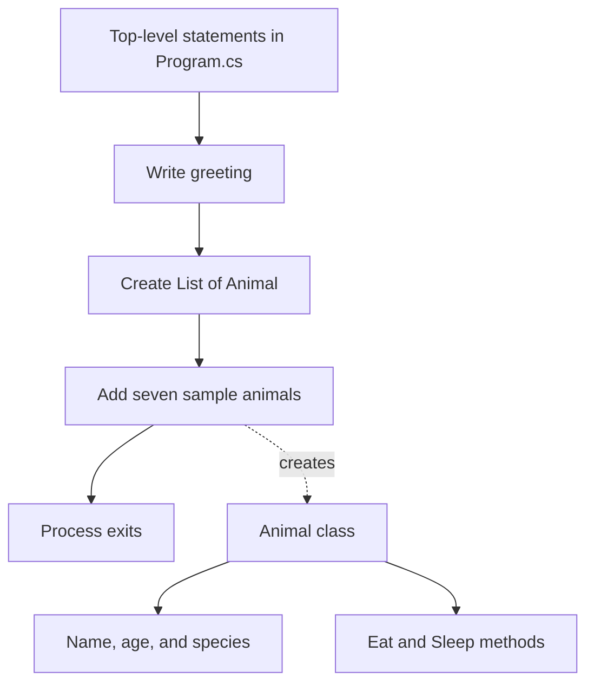

# Architecture

## Overview

This repository contains a single-project .NET 10 console application. It is best understood as a small object-oriented programming example rather than a layered or production application.

There are no external libraries, network calls, databases, configuration files, or background services. All application data is hard-coded and kept in memory.

## Components

### Application entry point

`Program.cs` uses C# top-level statements instead of an explicit `Program.Main` method. These statements print a greeting and populate a local animal collection.

The collection is not enumerated, returned, or passed to another component, so it becomes eligible for cleanup when the process exits.

### Domain model

The `Animal` class is declared in the same file as the application entry point. `AnimalName` and `Species` use the `required` modifier, which makes callers initialize them. `Age` defaults to `0` if omitted and currently accepts any integer.

`Eat()` and `Sleep()` directly write messages to `Console`. This is straightforward for a demonstration, but it couples the model to console output.

## Build configuration

The project file enables:

- `net10.0` as the target framework.
- Executable output through `OutputType`.
- Implicit global using directives.
- Nullable reference type analysis.

There are no package references, project references, custom build targets, or runtime identifiers.

## Constraints and edge cases

- Empty strings are valid for `AnimalName` and `Species`; `required` checks initialization, not content.
- Negative values and unrealistic values are valid for `Age` because there is no validation.
- Duplicate animals are allowed in the list.
- Behavior methods produce console side effects and do not return values.
- The sample collection has no observable effect on program output.

## Potential next steps

The appropriate next change depends on the project's intended use:

1. **For a learning sample:** enumerate the collection and invoke `Eat()` or `Sleep()` so the model has observable behavior.
2. **For a reusable model:** move `Animal` into its own file and separate domain behavior from console presentation.
3. **For safer input:** validate non-empty names and species and define an allowed age range.
4. **For maintainability:** add a test project covering object initialization, validation, and behavior output.
5. **For an interactive app:** accept user input or command-line arguments instead of relying only on hard-coded data.

These are recommendations only; the current implementation has deliberately been left unchanged.